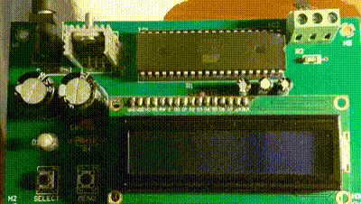

# Temperature Measurement and Display Device  

## Introduction
This product is a simple temperature measurement and display device built on the Atmega16 microcontroller and the LM35 temperature sensor. The primary goal of the project is to help users become familiar with the Atmega16 microcontroller and basic electronic components.

## Technical Specifications
- **Temperature Measurement Range**: 0°C - 100°C
- **Analog Temperature Sensor**: LM35D
- **Minimum Resolution**: 0.1°C

## Required Components
To assemble the product, you will need the following components:
- **Atmega16 Microcontroller**
- **LM35 Temperature Sensor**
- **Op-Amp OP07CP**
- **ICL7660** (Voltage Converter)
- **LM7805** (5V Voltage Regulator)

## Software
The product is programmed and developed using **Atmel Studio 7**. The program is uploaded to the microcontroller via **ProgISP** using **USBasp**.

## GitHub Repository
You can find the source code and additional documentation in the GitHub repository:  
[atmega16-lm35-temp-sensor](https://github.com/TrinhHuuGiang/atmega16-lm35-temp-sensor.git)

## Author
This project was carried out by **[Giang Trinh](https://github.com/TrinhHuuGiang)**. If you have any questions or need support, please contact me at [giangtrinhvnbl2k2@gmail.com].
